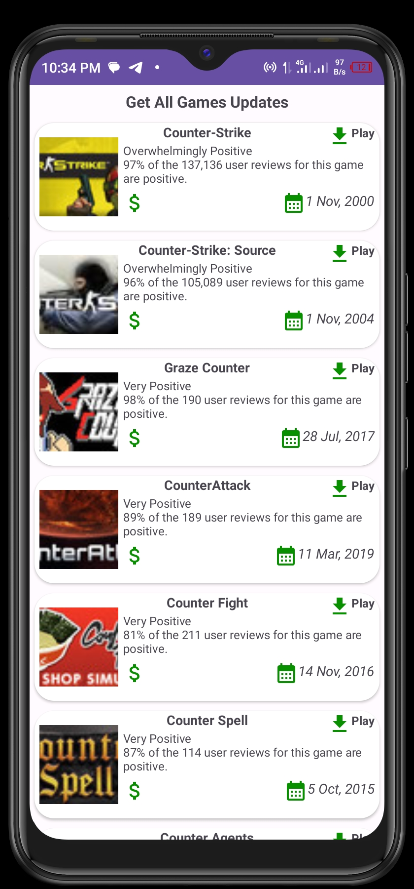

# Game List App (Android Kotlin)

The Game List App is an Android application that retrieves a list of games from a RapidAPI endpoint and displays them in a list format. Users can click on the "Play" or "Learn More" buttons to access additional details or play the selected games.

## Features

- Fetches game data from the RapidAPI game API.
- Displays the list of games in a user-friendly format.
- Provides options to view more details about each game.
- Allows users to learn more about a game by clicking the "Learn More" or "Play" button.

## Installation

1. Clone the repository to your local machine using Git or download it as a ZIP file.

2. Open Android Studio and import the project.

3. Build the project to resolve dependencies and ensure a successful build.

4. Obtain a RapidAPI API key by signing up on the RapidAPI website.

5. Replace `YOUR_RAPIDAPI_API_KEY` with your actual RapidAPI API key.

6. Run the app on an emulator or physical device.

## Usage

1. Once the app is launched, the list of games will be fetched from the RapidAPI game API and displayed on the home screen.

2. Scroll through the list to browse different games.

3. To play a game, tap the "Play" button on the detailed screen. This will redirect you to the game's official website to download.

## Screenshots

## Contributing

Contributions to the Game List App are welcome. If you have bug fixes, improvements, or new features to propose, please follow these steps:

1. Fork the repository.
2. Create a new branch for your feature or bug fix.
3. Make the necessary changes and commit them.
4. Push your changes to your forked repository.
5. Submit a pull request describing your changes.

## Contact

For any further inquiries or feedback, please contact the project maintainers at [daviekim.dev@gmail.com](mailto:daviekim.dev@gmail.com).
